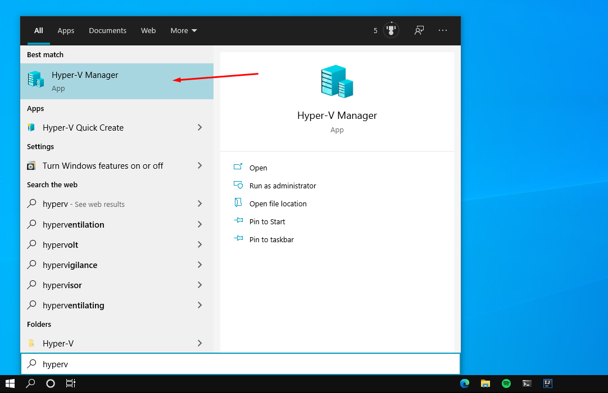
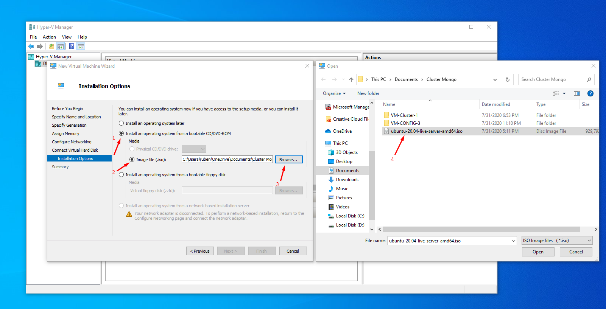

# 💫 Virtual Machine Configuration

> Mongo VM Configuration

Configuring a VM to deploy a mongo sharded cluster

---

### 🚀 Getting started

This section is how to deploy a mongo sharded cluster. From configuring a VM to Mongo Cluster Shard.

#### :cloud: Configuring a Virtual Machine

First of all, you should select an ISO to create a VM on HyperV. By the way, we're going to use HyperV to create a VM.

For this tutorial I'm gonna use Ubuntu ISO, where can be found in [Ubuntu Website Download](https://ubuntu.com/download/server).

# 

#### :open_file_folder: Opening HyperV

  

Then go to `New` > `Virtual Machine`

It'll open a creation page, so click next, on `Specify Name and Location`, use a name for the VM that you are configuring. For the Mongo Sharded Cluster, we're going to need 10 VM, that is

# 

##### :clipboard: What's going to need

`10` Virtual machines is what we are going to need.

3 Config VM

with the name like

- VM-Config-`number`

3 VM to compose a `Shard`

- VM-Shard-One-`number`

and 3 more VM to compose the other `Shard`

- VM-Shard-Two-`number`

and the last one for the router

- VM-Router

The name is your choice so, you decide, but I prefer to use those ones.

# 

#### :dart: Don't forget the configure the Network

On `Configure Networking` select your external `virtual switch`.

In case you don't know how to create a virtual switch, check the [docs in Microsoft Website Documentation](https://docs.microsoft.com/en-us/windows-server/virtualization/hyper-v/get-started/create-a-virtual-switch-for-hyper-v-virtual-machines) 

# 

#### :electric_plug: Creating by .iso

On `Installation Options` select `Install an operating system from bootable CD/DVD-ROM` and click `Image file (.iso):` then select your ISO that you [downloaded before](#cloud-configuring-a-virtual-machine).

  

# 

#### :bookmark: Turning the first time VM on

🚧 Working on it 🚧
